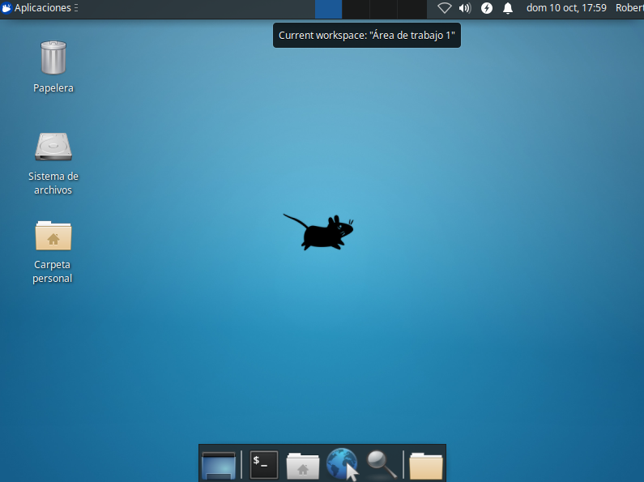
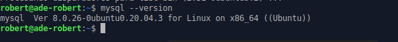
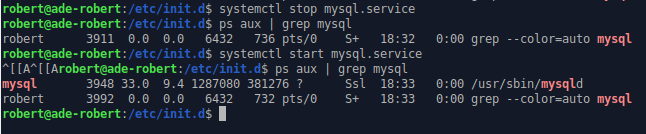

# U1_A2.- Instalación de MySQL Server en Ubuntu Server 20.04 LTS

### 1.-Instalar el Ubuntu Server 20.04 LTS

Descargamos la ISO y configuramos una MV con una instalación normal de Ubuntu Server.

Configuramos que nuestra MV se llame `ade-robert`.

Instalamos el servicio `SSH`.

#### 1.1 Instalación de escritorio.

- Actualizamos los repositorios

- Ejecutamos `sudo apt-get install xubuntu-desktop`.

### 2.- Instalar MySQL Server

### 3.- Comprobación de version estable

### 4.- Parar el demonio y reiniciar (init.d)

### 5.-

### 6.- Modificar BD MySQL

El usuario root nos denegaba la password y tenemos que implementar una nueva.

### 7.- Instalar MYSQL Workbench

- Comprobamos el funcionamiento del `Workbench` añadiendo una `SQL`.

### 8.- Instalar  Adminer sobre Apache

- Instalamos el `Adminer` siguiendo los pasos del PDF que nos ofrece la profesora.

> Hemos generado el archivo `adminer-4.7.8.php`.

### 8.2 Instalar PHPMyAdmin

